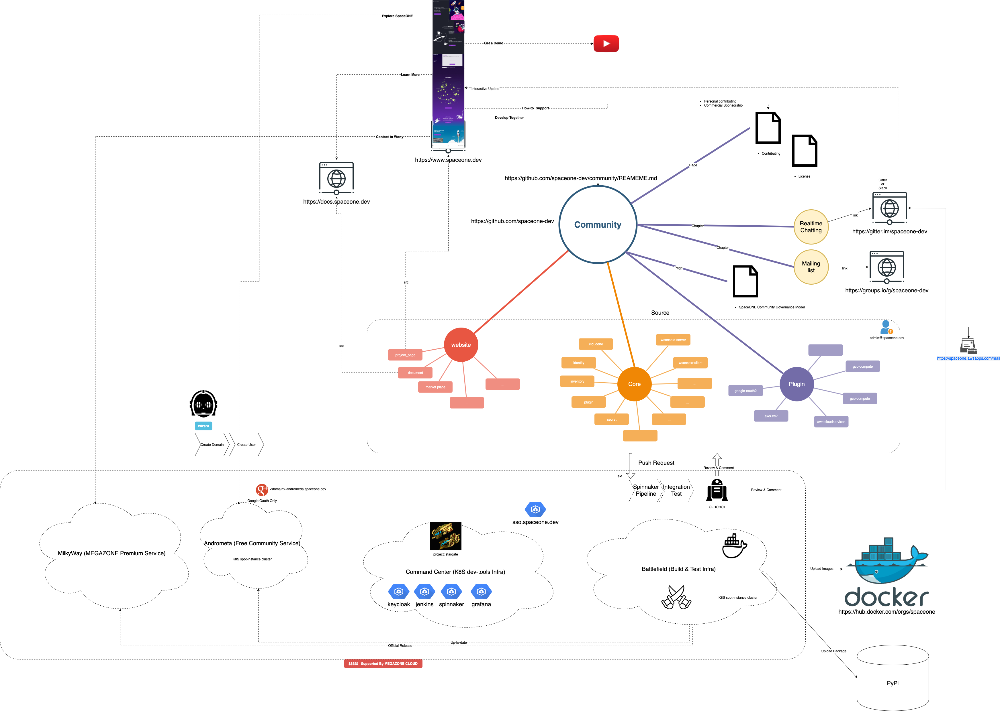

# SpaceONE Community

Welcome to the SpaceONE community!

- [Community Map](#Community-Map)
- [Membership](#Membership)
- [User Guides](#User-Guides)
- [Developer Guides](#Developer-Guides)
- [Communication](#Communication)

## Community Map
There are lots of starting points for joining and contributing to the SpaceONE community - improving docs, improving code, giving talks etc.

 
## Membership
We depend on new people becoming members and regular code contributors, so we would like you to come join us!
The SpaceONE project is divided into subprojects. Responsibilities for most roles are scoped to these subprojects.

| Role  | Responsibilities | Requirements   | Definded by |
| ----  | ---------------- | -------------- | ----------- |
| member | active contributor in the community | N/A  | SpaceONE Github org member. |
| reviewer | review contributions from other members | history of review and authorship in a subproject | [OWNERS] file reviewer entry. |
| approver | approve accepting contributions | highly experienced and active reviewer + contributor to a subproject | [OWNERS] file approver entry |
| subproject owner | set direction and priorities for a subproject | demonstrated responsibility and excellent technical judgement for the subproject | [OWNERS] file *owners* entry |

## User Guides

[User Guides]

## Developer Guides

[Developer Guides]

## Communication

### Gitter

Our real-time communication channel. Any github user can join.

[SpaceONE Q&A]

### Mailing List

The SpaceONE mailing lists are hosted through groups.io.

[Join] | [Mailing List]

[User Guides]: https://spaceone-dev.gitbook.io/user-guide/
[Developer Guides]: https://spaceone-dev.github.io/introduction/
[SpaceONE Q&A]: https://gitter.im/spaceone-dev/QnA
[Mailing List]: https://groups.io/g/spaceone
[Join]: https://groups.io/g/spaceone/join
